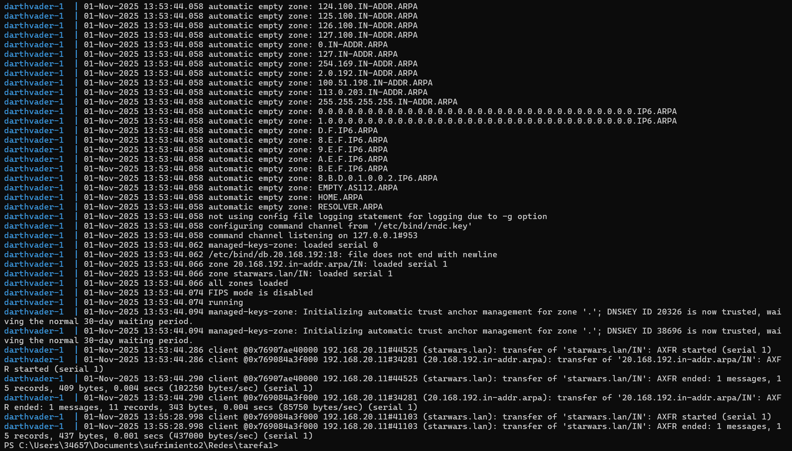
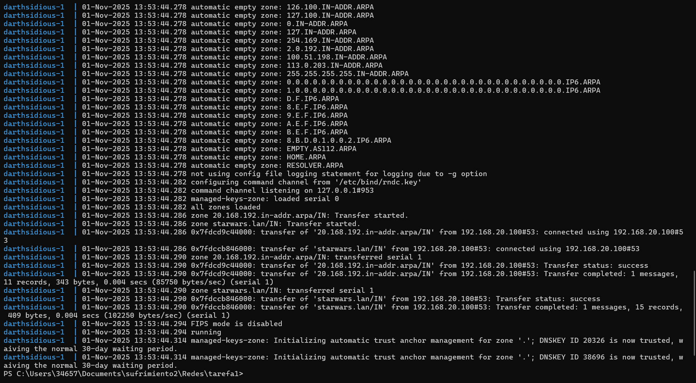

1. Tomaremos a máquina darthsidious, e configuraremola para ser servidor secundario, tanto da zona primaria de resolución directa como de resolución inversa. Captura os ficheiros de configuración en ambalas dúas máquinas. Fai unha captura onde se vexa o reinicio da máquina darthsidious, no que se vexa no log dos dous equipos e que se fixo a transferencia de zona.

