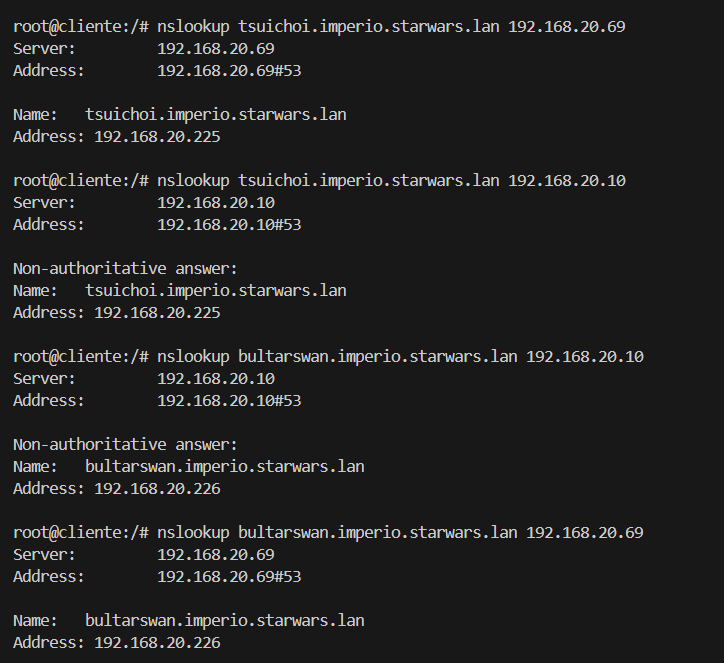

### 1. Instala no equipo darthvader un subdominio chamado antigarepublica, e nel os rexistros:
            A, xendor 192.168.20.222
            A, ardenlyn 192.168.20.223.
            Captura un cliente resolvendo un rexistro  A do dominio e do subdominio contra darthvader
---

### 2. Instala no equipo leia (Debian/Ubuntu Server) un subdominio delegado de "starwars.lan" chamado imperio. Engade nel os rexistros:
            A, tsuichoi 192.168.20.225
            A, bultarswan 192.168.20.226.
            Captura un cliente resolvendo un rexistro A do dominio e do subdominio contra leia e darthvader
---

