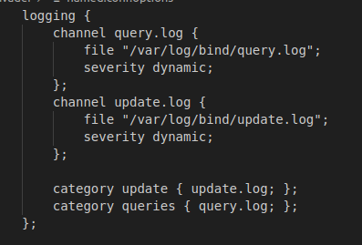
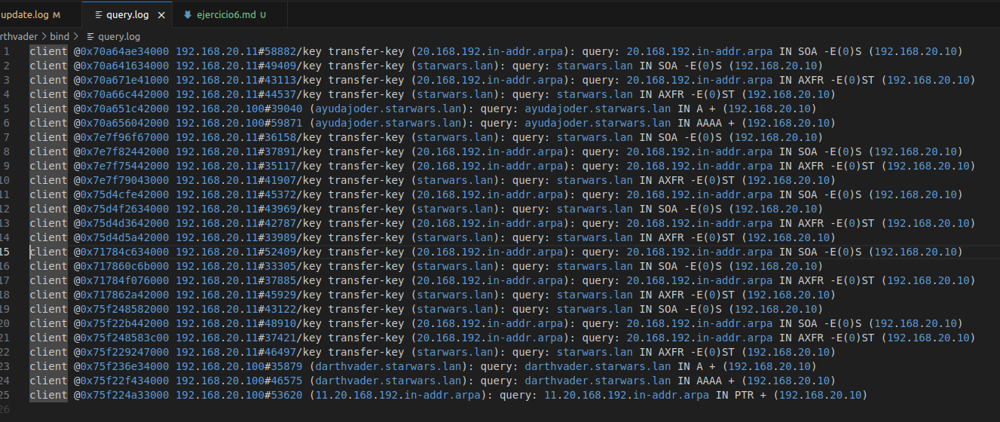
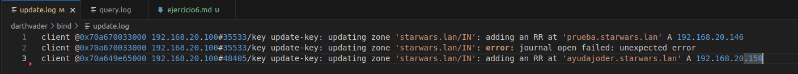
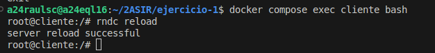
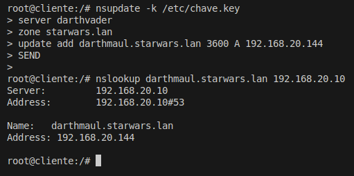

### 1. Fai que no equipo darthvader se faga un log de todas as consultas (/var/log/bind/queries.log) e de todas as actualizacions (/var/log/bind/update.log) a dous ficheiros de log diferentes. Captura a configuración. Amosa as capturas dos dous ficheiros de log, despois de facer consultas e actualizacións e transferencias de zona.
---

#### Configuración logs

#### Salida dos logs

### 2.Investiga como co comando "dig" podes pedir unha copia dunha zona.
---

No caso da zona starwars.lan por exemplo, pediríase así:

    dig @192.168.20.10 starwars.lan AXFR

### 3. Permite que o equipo darthvader poida ser controlado coa utilidade rndc desde un cliente ubuntu ou debian. Fai unha captura do servidor reiniciandose.
---

### 4. Mediante a utilidade nsupdate, engade un rexistro chamado darthmaul (192.168.20.144) á zona starwars.lan empregando chaves
---

